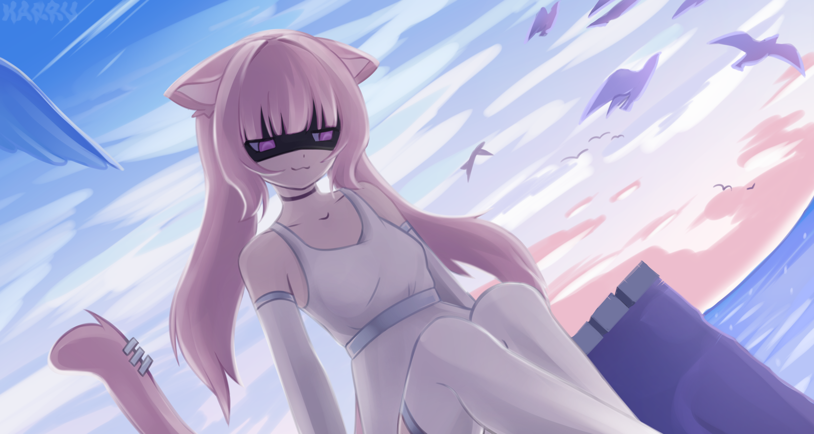

# RaisaAI



Голосовой ассистент на C++20: локальное распознавание речи (Vosk + Whisper),
LLM через Ollama (диалог + роутер инструментов), скиллы: музыка VK, таймер,
погода, поиск в интернете (DuckDuckGo), произвольный диалог.

## Содержание

- [Требования](#требования)
- [Сборка](#сборка)
- [Установка Vosk](#установка-vosk)
- [Конфигурация](#конфигурация)
  - [raisa.conf](#raisa-conf)
  - [vk.conf](#vk-conf)
- [setup.sh](#setupsh)
- [Запуск](#запуск)
- [Громкость](#громкость)
- [Структура проекта](#структура-проекта)

## Требования

**Сборка:**

- `g++` со стандартом C++20
- `cmake` (≥ 3.14)
- `pkg-config`
- FFmpeg dev: `libavdevice-dev libavformat-dev libavcodec-dev libavutil-dev libswresample-dev`
- libcurl: `libcurl4-openssl-dev`
- Vosk (см. [установка Vosk](#установка-vosk))
- Заголовочные библиотеки: `ctre.hpp` (compile-time regex) и `nlohmann/json.hpp` —
  в большинстве дистрибутивов есть готовые пакеты, либо положите заголовки вручную
  (`/usr/include` или через `CMakeLists.txt`)
- необязательно (ускоряют сборку): `ccache`, `ninja`, `ld.lld`

**Запуск:**

- `mpv` (воспроизведение музыки), `socat` (управление mpv)
- PulseAudio или `pipewire-pulse` (захват микрофона, вход `pulse`)
- `ollama` с локальными моделями (см. [raisa.conf](#raisa-conf))
- Python-модуль `urllib3` (установится через `setup.sh` при необходимости)

## Сборка

```bash
cmake -B build -DCMAKE_BUILD_TYPE=Release
cmake --build build -j$(nproc)
```

Исполняемый файл появится в `build/Raisa`. Можно собрать прямо в корне:

```bash
cmake -DCMAKE_BUILD_TYPE=Release .
make -j$(nproc)
```

## Установка Vosk

Пакеты Vosk есть в репозиториях большинства дистрибутивов:

- Arch Linux: `pacman -S vosk-api`
- Debian/Ubuntu: `sudo apt install libvosk-dev`

Устанавливают библиотеку `libvosk` и заголовок `vosk_api.h`.

Если готового пакета нет — соберите из исходников:
[alphacephei.com/vosk](https://alphacephei.com/vosk/) и установите в `/usr/local`.

## Конфигурация

### raisa.conf

| Ключ             | Назначение                                      |
| ---------------- | ----------------------------------------------- |
| `AUDIO_DEVICE`   | имя PulseAudio-входа микрофона                  |
| `AUDIO_RATE`     | частота дискретизации (используется и для Vosk) |
| `AUDIO_CHANNELS` | число каналов                                   |
| `VOSK_PATH`      | путь к модели Vosk                              |
| `WHISPER_URL`    | адрес whisper-server (`http://localhost:8000`)  |
| `OLLAMA_URL`     | адрес Ollama (`http://localhost:11434`)         |
| `LLM_MODEL`      | модель для обычного диалога                     |
| `ROUTER_MODEL`   | модель-роутер (выбор инструмента/скилла)        |

Пример:

```ini
AUDIO_DEVICE=Raisa
AUDIO_RATE=48000
AUDIO_CHANNELS=1
VOSK_PATH=./Models/vosk-model-small/
WHISPER_URL=http://127.0.0.1:8000/inference
OLLAMA_URL=http://localhost:11434
LLM_MODEL=gemma4:e4b
ROUTER_MODEL=gemma4:e4b
```

## setup.sh

Установщик проверяет зависимости и выполняет подготовку окружения:
загружает модель Vosk (`vosk-model-small-ru-0.22`, ~46 МБ) из основного
зеркала (с фолбэком на Hugging Face), проверяет/собирает whisper-server,
а затем запускает фоновые сервисы (whisper).

```bash
./setup.sh              # полная проверка + запуск сервисов
./setup.sh --check-only # только проверка, ничего не запускать
./setup.sh --no-whisper # пропустить whisper
```

Модель whisper (например `ggml-podlodka-turbo-q8_0.bin`) поместите в `Models/`
или задайте путь через `export WHISPER_MODEL=/путь/к/модели.bin`.

Остановить сервисы:

```bash
kill $(cat /tmp/raisa/*.pid)
```

## Запуск

```bash
./setup.sh          # при первом запуске
./Raisa             # из корня проекта (после сборки)
```

## Структура проекта

```
.
├── CMakeLists.txt          # сборка (FFmpeg/libcurl — REQUIRED, Vosk — обязателен)
├── raisa.conf              # конфиг ассистента
├── vk.conf                 # секреты VK (chmod 600)
├── setup.sh                # установщик/запуск сервисов
├── assets/                 # картинки для README и ui-ресурсы
├── src/
│   ├── app/main.cpp        # точка входа
│   ├── core/               # Config, Process (exec), Paths, Text
│   ├── audio/              # захват микрофона (PulseAudio/AV)
│   ├── speech/             # распознавание Vosk/Whisper
│   ├── llm/                # клиент Ollama
│   ├── skills/             # LiM, Timer, VK-музыка, Погода + регистр/роутер
│   ├── skills/model/       # LmTypes, WeatherTypes
│   ├── vkmusic/            # vk.py (мост к VK Music)
│   ├── youtubemusic/       # ytMusic.py (мост к YouTube Music)
│   ├── ddg/                # ddg.py + vendor/ (поиск DuckDuckGo, MIT/BSD)
│   ├── net/ playback/ daemon/
├── Models/                 # модели Vosk/whisper
└── whisper.cpp/            # сборка whisper-server (для Whisper-распознавания)
```

`vk.conf` — приватный файл с токенами VK.
